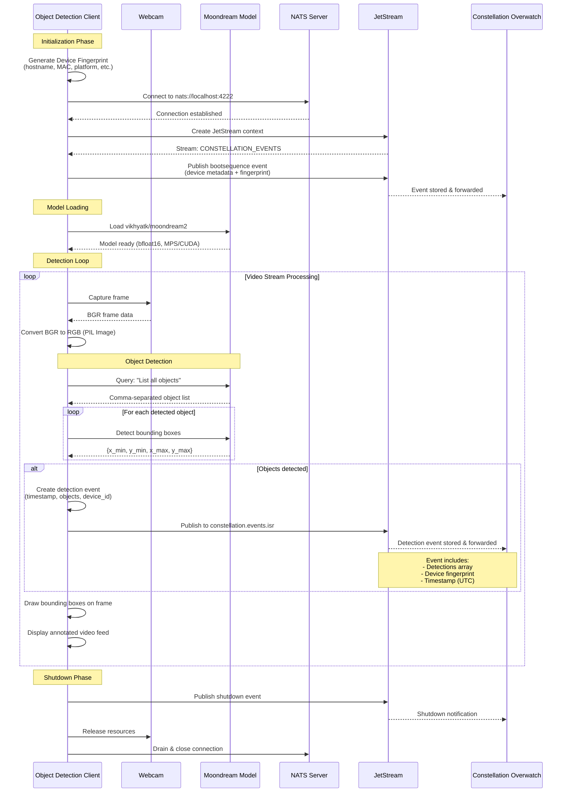

# Constellation Overwatch Object Detection Client

Run real-time video edge inference and transmit detected objects as events to [Constellation Overwatch](https://github.com/Constellation-Overwatch/constellation-overwatch).

Two detection models available:

- **RT-DETR** (Recommended): Real-time transformer detection, 30-60 FPS, 80 COCO classes
- **Moondream**: Vision-language model with natural language queries (slower)

### EXPERIMENTAL
Only tested on macOS. Needs to be integrated with ffmpeg streams from ROS and aviation feeds.

## Requirements

- [Constellation Overwatch](https://github.com/Constellation-Overwatch/constellation-overwatch)
- [uv](https://astral.sh) - A fast Python package installer and resolver

## Data Flow Diagram



## Installation & Setup

```sh
git clone https://github.com/Constellation-Overwatch/overwatch-obj-detection.git
cd overwatch-obj-detection
uv sync
```

### Environment Configuration

The client requires Constellation identifiers to connect to Overwatch. These can be provided via environment variables using a `.env` file:

1. Copy the example environment file:

```sh
cp .env.example .env
```

2. Edit `.env` and add your Constellation credentials:

```env
CONSTELLATION_ORG_ID=your-organization-id-here
CONSTELLATION_ENTITY_ID=your-entity-id-here

# Disable HuggingFace Hub connectivity checks (use cached models only)
HF_HUB_OFFLINE=1
TRANSFORMERS_OFFLINE=1
```

You can obtain the Constellation IDs from:

- Constellation Overwatch Edge Awareness Kit UI
- Your Database Administrator

If these environment variables are not set, the client will prompt you to enter them interactively at runtime.

**Note:** The `HF_HUB_OFFLINE` and `TRANSFORMERS_OFFLINE` settings prevent model loading delays by skipping online checks.

## Usage

### Model Selection

Two detection models are available:

#### RT-DETR (Recommended for Real-Time)

```sh
# Auto-detect camera
uv run -m detect_rtdetr

# Use specific camera
uv run -m detect_rtdetr --camera 0
```

**Advantages:**

- **Fast**: 30-60 FPS real-time detection
- **No downloads**: Instant startup, no HuggingFace delays
- **Pre-trained**: Detects 80 COCO classes (person, car, dog, etc.)
- **Confidence scores**: Each detection includes confidence level
- **Production-ready**: Battle-tested YOLO architecture

Model location: `models/rtdetr-l.pt` (downloads automatically on first run)

#### Moondream (Flexible Natural Language)

```sh
# Auto-detect camera
uv run -m detect

# Use specific camera
uv run -m detect --camera 0
```

**Advantages:**

- **Natural language queries**: Ask "what objects do you see?"
- **Flexible**: Can detect anything described in text
- **Accurate**: Vision-language model understanding

**Trade-offs:**

- Slower inference (~2-5 FPS)
- Requires HuggingFace model download
- Higher memory usage

### Quick Start

#### Auto-detect and use first available camera

```sh
# RT-DETR (recommended)
uv run -m detect_rtdetr

# Moondream
uv run -m detect
```

The client will automatically detect and use the first available camera.

#### Use external camera (skip built-in)

```sh
# RT-DETR
uv run -m detect_rtdetr --skip-native

# Moondream
uv run -m detect --skip-native
```

Automatically selects the first external camera/capture device, ignoring built-in cameras.

### List Available Video Devices

```sh
# Works with either model
uv run -m detect --list-devices
uv run -m detect_rtdetr --list-devices
```

Shows all available video capture devices with details (resolution, FPS, backend).

### Camera Diagnostics (Recommended for macOS)

On macOS, camera indices detected by system tools may not match OpenCV's actual indexing. Use the diagnostics tool to verify which camera is at which index:

```sh
uv run utils/camera_diagnostics.py
```

This will:

- List all detected cameras from both system_profiler and OpenCV
- Show resolution, FPS, and backend for each camera
- Offer to preview each camera so you can verify which is which
- Help you determine the correct index to use with `--camera`

**Important:** The preview test is the most reliable way to confirm which camera index corresponds to your desired video source.

### Video Source Options

All video source options work with both detection models.

#### Camera by Index

```sh
# RT-DETR
uv run -m detect_rtdetr --camera 0

# Moondream
uv run -m detect --camera 1
```

#### Camera by Device Path (Linux)

```sh
# RT-DETR
uv run -m detect_rtdetr --device /dev/video4

# Moondream
uv run -m detect --device /dev/video4
```

#### RTSP Stream

```sh
# RT-DETR with RTSP
uv run -m detect_rtdetr --rtsp rtsp://192.168.50.2:8554/live/stream

# Moondream with RTSP
uv run -m detect --rtsp rtsp://localhost:8554/live/stream
```

#### HTTP Stream

```sh
# RT-DETR with HTTP stream
uv run -m detect_rtdetr --http http://192.168.1.100:8080/stream.mjpg

# Moondream with HTTP stream
uv run -m detect --http http://192.168.1.100:8080/stream.mjpg
```

### Command Line Options

| Option | Description |
|--------|-------------|
| `--list-devices` | List all available video devices and exit |
| `--camera <index>` | Use camera at specified index (e.g., 0, 1, 2) |
| `--device <path>` | Use device at specified path (e.g., /dev/video4) |
| `--rtsp <url>` | Connect to RTSP stream at URL |
| `--http <url>` | Connect to HTTP stream at URL |
| `--skip-native` | Skip built-in/native cameras during auto-detection |
| `--rtsp-ip <ip>` | RTSP server IP (legacy) |
| `--rtsp-port <port>` | RTSP server port (legacy, default: 8554) |
| `--rtsp-path <path>` | RTSP stream path (legacy, default: /live/stream) |

### Advanced Usage

#### External Capture Devices

For high-quality capture devices like Elgato Cam Link 4K:

```sh
# RT-DETR (recommended for high FPS)
uv run -m detect_rtdetr --skip-native

# Moondream
uv run -m detect --skip-native
```

The client automatically applies optimizations:

- Minimal buffering for low latency
- 60 FPS target (if device supports)
- MJPEG codec for hardware acceleration

#### Model Storage

Models are stored in the `models/` directory:

```text
obj-detection-client/
├── models/
│   └── rtdetr-l.pt          # RT-DETR model (~115MB)
└── ~/.cache/huggingface/    # Moondream models (downloaded on first run)
```

**RT-DETR**: Downloads automatically to `models/rtdetr-l.pt` on first run

**Moondream**: Downloads to HuggingFace cache directory on first run

#### Window Positioning

The OpenCV display window is automatically positioned at (100, 100) with a size of 1280x720 pixels. The window is resizable and can be moved as needed.

Window titles:

- RT-DETR: `Constellation ISR - [Camera Name]`
- Moondream: `Constellation ISR - Device: [Device ID]`

To exit the stream, press `q` in the video window.

#### Detection Output Format

Both models publish the same JetStream event format:

```json
{
  "timestamp": "2025-01-18T12:34:56.789Z",
  "event_type": "detection",
  "count": 3,
  "detections": [
    {
      "label": "person",
      "confidence": 0.87,
      "x_min": 0.2,
      "y_min": 0.3,
      "x_max": 0.8,
      "y_max": 0.9
    }
  ],
  "source": {
    "device_id": "9abe4aa4...",
    "hostname": "macbook.local",
    "camera": {
      "name": "Cam Link 4K",
      "index": 0
    }
  }
}
```

**Note**: RT-DETR includes `confidence` scores, Moondream does not.
