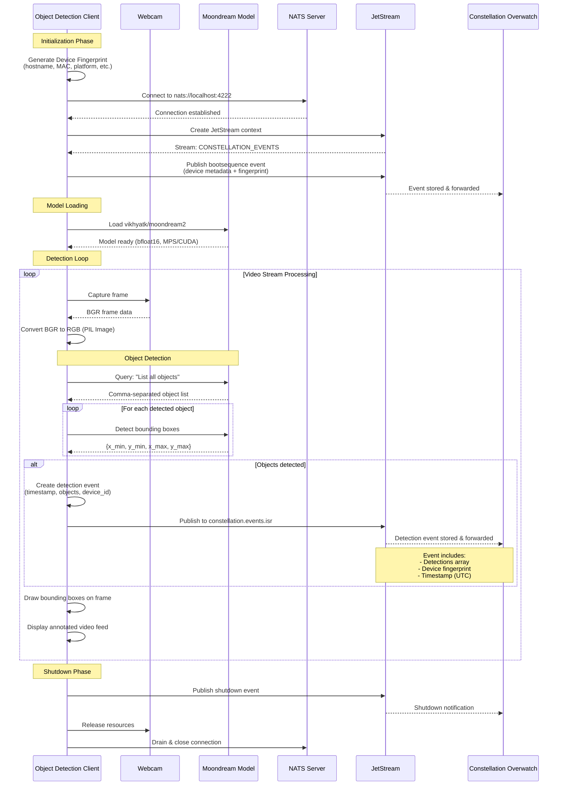

# Constellation Overwatch Object Detection Client

## TODO:
- refactor all py scripts into single model swapable modularity flags

Run real-time video edge inference and transmit detected objects as events to [Constellation Overwatch](https://github.com/Constellation-Overwatch/constellation-overwatch).

## Available Detection Models

### Model Comparison

| Model | Script | FPS | Classes | Threat Detection | Best For |
|-------|--------|-----|---------|------------------|----------|
| **RT-DETR** | `detect_rtdetr.py` | 30-60 | 80 COCO | ❌ | Production, Real-time |
| **YOLOE C4ISR** | `detect_yoloe_c4isr.py` | 15-30 | Custom (text prompts) | ✅ 4-level | Military, Security |
| **YOLOE** | `detect_yoloe.py` | 15-30 | Custom (text prompts) | ❌ | Custom detection, Tracking |
| **SAM3** | `detect_sam3.py` | 10-20 | Any (auto-segment) | ❌ | Segmentation, Masks |
| **Moondream** | `detect.py` | 2-5 | Any (natural language) | ❌ | Research, Flexibility |

### Production Models

1. **RT-DETR** (`detect_rtdetr.py`) - **Recommended for Real-Time**
   - Real-time transformer detection, 30-60 FPS
   - 80 COCO classes (person, car, dog, etc.)
   - Model: `rtdetr-l.pt` (~115MB)
   - Best for: Production, real-time surveillance

2. **YOLOE C4ISR** (`detect_yoloe_c4isr.py`) - **C4ISR Threat Detection**
   - Open-vocabulary detection with text prompts
   - Threat classification (HIGH/MEDIUM/LOW/NORMAL)
   - Publishes individual detection events + aggregated threat intelligence
   - Model: `yoloe-11l-seg.pt` (~140MB)
   - Best for: Military operations, threat assessment, security

3. **YOLOE** (`detect_yoloe.py`) - **Open-Vocabulary Detection**
   - Text-prompt based object detection
   - Object tracking with BoTSORT
   - Detects any class via text descriptions
   - Model: `yoloe-11l-seg.pt` (~140MB)
   - Best for: Custom object detection, flexible queries

4. **SAM3** (`detect_sam3.py`) - **Segmentation Anything**
   - Automatic mask generation (currently uses SAM2)
   - Instance segmentation without prompts
   - Pixel-precise object boundaries
   - Model: `sam2_b.pt` (~90MB)
   - Best for: Precise segmentation, object isolation

### Legacy Models

1. **Moondream** (`detect.py`) - **Vision-Language Model**
   - Natural language queries
   - Flexible detection
   - Slower inference (~2-5 FPS)
   - Best for: Research, flexible queries

### EXPERIMENTAL

Only tested on macOS. Needs to be integrated with ffmpeg streams from ROS and aviation feeds.

## Requirements

- [Constellation Overwatch](https://github.com/Constellation-Overwatch/constellation-overwatch)
- [uv](https://astral.sh) - A fast Python package installer and resolver

## Data Flow Diagram



## Installation & Setup

```sh
git clone https://github.com/Constellation-Overwatch/overwatch-obj-detection.git
cd overwatch-obj-detection
uv sync
```

### Environment Configuration

The client requires Constellation identifiers to connect to Overwatch. These can be provided via environment variables using a `.env` file:

1. Copy the example environment file:

```sh
cp .env.example .env
```

2. Edit `.env` and add your Constellation credentials:

```env
CONSTELLATION_ORG_ID=your-organization-id-here
CONSTELLATION_ENTITY_ID=your-entity-id-here

# Disable HuggingFace Hub connectivity checks (use cached models only)
HF_HUB_OFFLINE=1
TRANSFORMERS_OFFLINE=1
```

You can obtain the Constellation IDs from:

- Constellation Overwatch Edge Awareness Kit UI
- Your Database Administrator

If these environment variables are not set, the client will prompt you to enter them interactively at runtime.

**Note:** The `HF_HUB_OFFLINE` and `TRANSFORMERS_OFFLINE` settings prevent model loading delays by skipping online checks.

## Usage

### Quick Start Guide

Choose the detection model based on your use case:

#### 1. RT-DETR - Fast Real-Time Detection (Recommended)

```sh
# Auto-detect camera
uv run -m detect_rtdetr

# Specific camera
uv run -m detect_rtdetr --camera 0

# RTSP stream
uv run -m detect_rtdetr --rtsp rtsp://192.168.50.2:8554/live/stream
```

**Best for:** Production, surveillance, high FPS requirements

#### 2. YOLOE C4ISR - Military Threat Detection

```sh
# Auto-detect camera with threat classification
uv run python detect_yoloe_c4isr.py --camera 0

# Lower confidence for sensitive detection
uv run python detect_yoloe_c4isr.py --conf 0.15 --min-frames 1

# Add custom threat classes
uv run python detect_yoloe_c4isr.py --custom-threats "drone" "robot"
```

**Best for:** C4ISR operations, threat assessment, security monitoring

**Features:**

- Text-prompt threat detection (weapon, suspicious package, person, etc.)
- 4-level threat classification (HIGH/MEDIUM/LOW/NORMAL)
- Individual detection events + aggregated threat intelligence
- Color-coded bounding boxes with corner markers
- Publishes to both JetStream (events) and KV store (state)

**Published Events:**

- `detection` events - Each individual detection to stream
- `threat_alert` events - Aggregated threat intelligence
- `bootsequence` / `shutdown` - System lifecycle events

**KV Store Keys:**

- `{entity_id}.c4isr.threat_intelligence` - Full threat data
- `{entity_id}.analytics.c4isr_summary` - Analytics summary

#### 3. YOLOE - Open-Vocabulary Detection

```sh
# Auto-detect camera with object tracking
uv run python detect_yoloe.py --camera 0

# Adjust tracking parameters
uv run python detect_yoloe.py --min-frames 3 --tracker botsort.yaml
```

**Best for:** Custom object detection, flexible queries, object tracking

#### 4. SAM3 - Segmentation Anything

```sh
# Auto-detect camera with automatic segmentation
uv run python detect_sam3.py --camera 0

# Adjust segmentation sensitivity
uv run python detect_sam3.py --conf 0.3 --imgsz 1024
```

**Best for:** Precise segmentation, object isolation, mask generation

#### 5. Moondream - Vision-Language Model (Legacy)

```sh
# Auto-detect camera
uv run -m detect

# Use specific camera
uv run -m detect --camera 0
```

**Best for:** Research, flexible natural language queries

**Trade-offs:** Slower inference (~2-5 FPS), higher memory usage

### Quick Start

#### Auto-detect and use first available camera

```sh
# RT-DETR (recommended)
uv run -m detect_rtdetr

# Moondream
uv run -m detect
```

The client will automatically detect and use the first available camera.

#### Use external camera (skip built-in)

```sh
# RT-DETR
uv run -m detect_rtdetr --skip-native

# Moondream
uv run -m detect --skip-native
```

Automatically selects the first external camera/capture device, ignoring built-in cameras.

### List Available Video Devices

```sh
# Works with either model
uv run -m detect --list-devices
uv run -m detect_rtdetr --list-devices
```

Shows all available video capture devices with details (resolution, FPS, backend).

### Camera Diagnostics (Recommended for macOS)

On macOS, camera indices detected by system tools may not match OpenCV's actual indexing. Use the diagnostics tool to verify which camera is at which index:

```sh
uv run utils/camera_diagnostics.py
```

This will:

- List all detected cameras from both system_profiler and OpenCV
- Show resolution, FPS, and backend for each camera
- Offer to preview each camera so you can verify which is which
- Help you determine the correct index to use with `--camera`

**Important:** The preview test is the most reliable way to confirm which camera index corresponds to your desired video source.

### Video Source Options

All video source options work with both detection models.

#### Camera by Index

```sh
# RT-DETR
uv run -m detect_rtdetr --camera 0

# Moondream
uv run -m detect --camera 1
```

#### Camera by Device Path (Linux)

```sh
# RT-DETR
uv run -m detect_rtdetr --device /dev/video4

# Moondream
uv run -m detect --device /dev/video4
```

#### RTSP Stream

```sh
# RT-DETR with RTSP
uv run -m detect_rtdetr --rtsp rtsp://192.168.50.2:8554/live/stream

# Moondream with RTSP
uv run -m detect --rtsp rtsp://localhost:8554/live/stream
```

#### HTTP Stream

```sh
# RT-DETR with HTTP stream
uv run -m detect_rtdetr --http http://192.168.1.100:8080/stream.mjpg

# Moondream with HTTP stream
uv run -m detect --http http://192.168.1.100:8080/stream.mjpg
```

### Command Line Options

| Option | Description |
|--------|-------------|
| `--list-devices` | List all available video devices and exit |
| `--camera <index>` | Use camera at specified index (e.g., 0, 1, 2) |
| `--device <path>` | Use device at specified path (e.g., /dev/video4) |
| `--rtsp <url>` | Connect to RTSP stream at URL |
| `--http <url>` | Connect to HTTP stream at URL |
| `--skip-native` | Skip built-in/native cameras during auto-detection |
| `--rtsp-ip <ip>` | RTSP server IP (legacy) |
| `--rtsp-port <port>` | RTSP server port (legacy, default: 8554) |
| `--rtsp-path <path>` | RTSP stream path (legacy, default: /live/stream) |

### Advanced Usage

#### External Capture Devices

For high-quality capture devices like Elgato Cam Link 4K:

```sh
# RT-DETR (recommended for high FPS)
uv run -m detect_rtdetr --skip-native

# Moondream
uv run -m detect --skip-native
```

The client automatically applies optimizations:

- Minimal buffering for low latency
- 60 FPS target (if device supports)
- MJPEG codec for hardware acceleration

#### Model Storage

All models are automatically downloaded to the `models/` directory on first run:

```text
obj-detection-client/
├── models/
│   ├── rtdetr-l.pt          # RT-DETR model (~115MB)
│   ├── yoloe-11l-seg.pt     # YOLOE model (~140MB)
│   └── sam2_b.pt            # SAM2 model (~90MB)
└── ~/.cache/huggingface/    # Moondream models (downloaded on first run)
```

**Model Download Behavior:**

1. **First Run:** Models download automatically from Ultralytics
2. **Caching:** Models are cached in `models/` directory for offline use
3. **No Re-downloads:** Existing models are reused on subsequent runs

**Storage Requirements:**

- RT-DETR: ~115MB
- YOLOE (both versions): ~140MB (shared model file)
- SAM2/SAM3: ~90MB
- Moondream: ~3GB (HuggingFace cache)

#### Window Positioning

The OpenCV display window is automatically **centered on screen** with a size of 1280x720 pixels. The window is **fully draggable and resizable** after opening.

**Window Features:**

- Auto-centered on startup
- Draggable to any position
- Resizable (maintains aspect ratio)
- Professional threat indicators (C4ISR model)
- Corner markers on bounding boxes (C4ISR model)

**Window Titles:**

- RT-DETR: `Constellation ISR - [Camera Name]`
- YOLOE C4ISR: `C4ISR Threat Detection - [Camera Name]`
- YOLOE: `Constellation ISR Tracking - [Camera Name]`
- SAM3: `Constellation ISR Segmentation - [Camera Name]`
- Moondream: `Constellation ISR - Device: [Device ID]`

**Controls:**

- Press `q` to exit the stream
- Window can be dragged and resized during operation

#### Detection Output Format

**Standard Detection Event (RT-DETR, YOLOE):**

```json
{
  "timestamp": "2025-01-18T12:34:56.789Z",
  "event_type": "detection",
  "count": 3,
  "detections": [
    {
      "label": "person",
      "confidence": 0.87,
      "x_min": 0.2,
      "y_min": 0.3,
      "x_max": 0.8,
      "y_max": 0.9
    }
  ],
  "source": {
    "device_id": "9abe4aa4...",
    "hostname": "macbook.local",
    "camera": {
      "name": "Cam Link 4K",
      "index": 0
    }
  }
}
```

**C4ISR Detection Event (YOLOE C4ISR):**

```json
{
  "timestamp": "2025-01-18T12:34:56.789Z",
  "event_type": "detection",
  "entity_id": "1048bff5-5b97-4fa8-a0f1-061662b32163",
  "device_id": "85c48d7842ce14df",
  "detection": {
    "track_id": "123_0",
    "label": "weapon",
    "confidence": 0.92,
    "threat_level": "HIGH_THREAT",
    "bbox": {
      "x_min": 0.2,
      "y_min": 0.3,
      "x_max": 0.8,
      "y_max": 0.9
    },
    "suspicious_indicators": [
      "high_confidence_weapon_detection"
    ]
  }
}
```

**C4ISR Threat Intelligence (KV Store):**

```json
{
  "timestamp": "2025-01-18T12:34:56.789Z",
  "entity_id": "1048bff5-5b97-4fa8-a0f1-061662b32163",
  "device_id": "85c48d7842ce14df",
  "mission": "C4ISR",
  "threat_summary": {
    "total_threats": 2,
    "threat_distribution": {
      "HIGH_THREAT": 1,
      "MEDIUM_THREAT": 1
    },
    "alert_level": "HIGH"
  },
  "tracked_objects": {
    "123_0": {
      "track_id": "123_0",
      "label": "weapon",
      "threat_level": "HIGH_THREAT",
      "avg_confidence": 0.89,
      "suspicious_indicators": ["high_confidence_weapon_detection"]
    }
  }
}
```

**Notes:**

- RT-DETR and YOLOE include `confidence` scores
- C4ISR model publishes **both** individual detection events and aggregated threat intelligence
- SAM3 publishes segmentation masks with detection events
- Moondream does not include confidence scores
