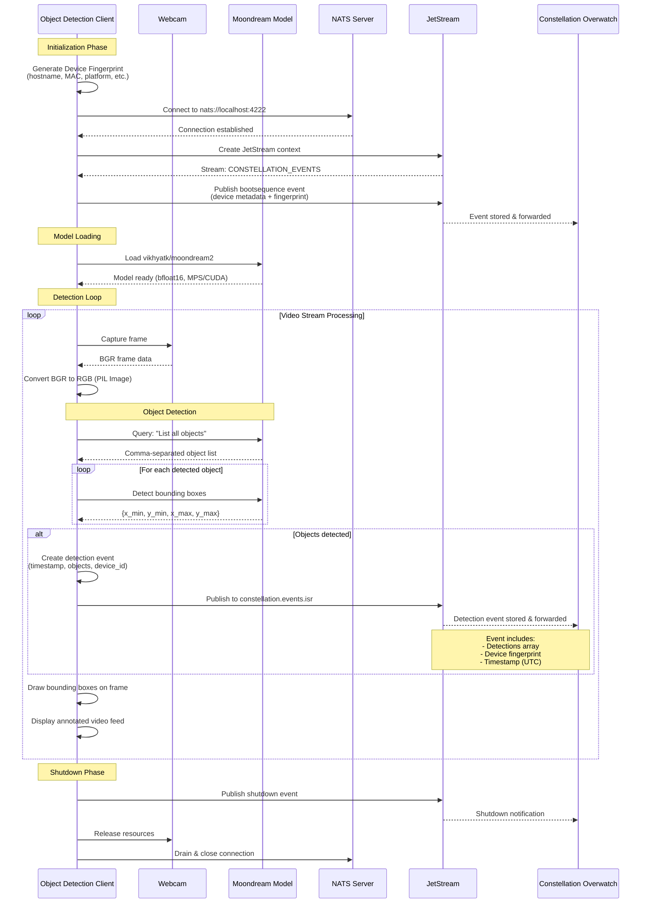

# Constellation Overwatch Object Detection Client

Run video edge inference with [Moondream](https://moondream.ai) and transmit detected objects as events to [Constellation Overwatch](https://github.com/Constellation-Overwatch/constellation-overwatch).

### EXPERIMENTAL
Only tested on macOS. Needs to be integrated with ffmpeg streams from ROS and aviation feeds.

## Requirements

- [Constellation Overwatch](https://github.com/Constellation-Overwatch/constellation-overwatch)
- [uv](https://astral.sh) - A fast Python package installer and resolver

## Data Flow Diagram



## Installation & Setup

```sh
git clone https://github.com/Constellation-Overwatch/overwatch-obj-detection.git
cd overwatch-obj-detection
uv sync
```

### Environment Configuration

The client requires Constellation identifiers to connect to Overwatch. These can be provided via environment variables using a `.env` file:

1. Copy the example environment file:

```sh
cp .env.example .env
```

2. Edit `.env` and add your Constellation credentials:

```env
CONSTELLATION_ORG_ID=your-organization-id-here
CONSTELLATION_ENTITY_ID=your-entity-id-here
```

You can obtain these IDs from:

- Constellation Overwatch Edge Awareness Kit UI
- Your Database Administrator

If these environment variables are not set, the client will prompt you to enter them interactively at runtime.

## Usage

### Default Webcam Mode

```sh
uv run detect.py
```

### RTSP Stream Mode

To connect to an RTSP stream (e.g., from FFmpeg):

```sh
uv run detect.py --rtsp-ip 192.168.50.2 --rtsp-port 8554 --rtsp-path /live/stream
```

Command line options:

- `--rtsp-ip`: RTSP stream IP address
- `--rtsp-port`: RTSP stream port (default: 8554)
- `--rtsp-path`: RTSP stream path (default: /live/stream)
