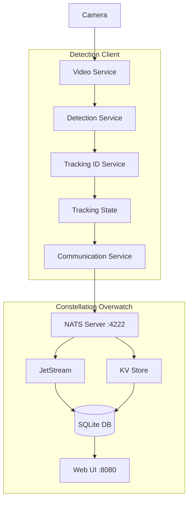
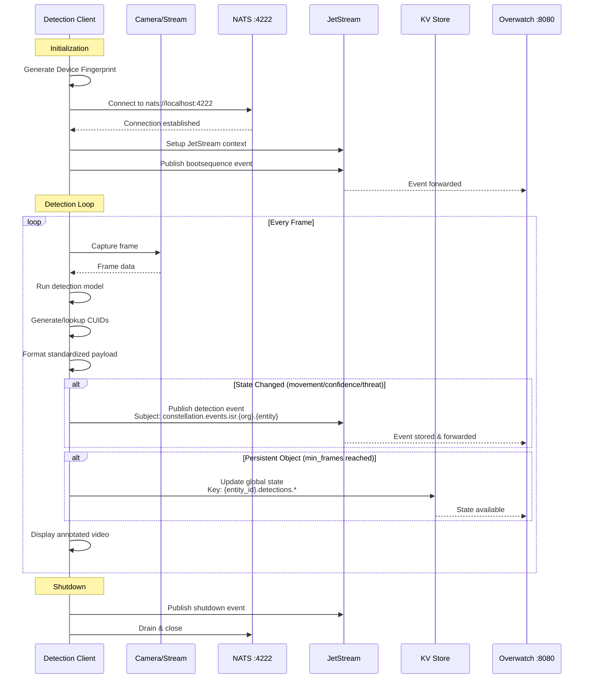

# Constellation Overwatch Object Detection Client

Unified real-time video edge inference system with modular architecture. Run detection with any model via a single entry point and transmit detected objects as events to [Constellation Overwatch](https://github.com/Constellation-Overwatch/constellation-overwatch).

## Available Detection Models

All models are accessible through the unified `overwatch.py` entry point using the `--model` flag.

### Model Comparison

| Model | Flag | FPS | Classes | Threat Detection | Best For |
|-------|------|-----|---------|------------------|----------|
| **YOLOE C4ISR** | `--model yoloe_c4isr` **(default)** | 15-30 | Custom (text prompts) | ✅ 4-level | Military, Security |
| **RT-DETR** | `--model rtdetr` | 30-60 | 80 COCO | ❌ | Production, Real-time |
| **YOLOE** | `--model yoloe` | 15-30 | Custom (text prompts) | ❌ | Custom detection, Tracking |
| **SAM2** | `--model sam2` | 10-20 | Any (auto-segment) | ❌ | Segmentation, Masks |
| **Moondream** | `--model moondream` | 2-5 | Any (natural language) | ❌ | Research, Flexibility |

### Default Model

1. **YOLOE C4ISR** (`--model yoloe_c4isr`) - **Default C4ISR Threat Detection**
   - Open-vocabulary detection with text prompts
   - Advanced threat classification (HIGH/MEDIUM/LOW/NORMAL)
   - Publishes individual detection events + aggregated threat intelligence
   - Model: `yoloe-11l-seg.pt` (~140MB)
   - Best for: Military operations, threat assessment, security

### Production Models

2. **RT-DETR** (`--model rtdetr`) - **High-Performance Real-Time**
   - Real-time transformer detection, 30-60 FPS
   - 80 COCO classes (person, car, dog, etc.)
   - Model: `rtdetr-l.pt` (~115MB)
   - Best for: Production, real-time surveillance

3. **YOLOE** (`--model yoloe`) - **Open-Vocabulary Detection**
   - Text-prompt based object detection
   - Object tracking with BoTSORT
   - Detects any class via text descriptions
   - Model: `yoloe-11l-seg.pt` (~140MB)
   - Best for: Custom object detection, flexible queries

4. **SAM2** (`--model sam2`) - **Segmentation Anything**
   - Automatic mask generation with SAM2
   - Instance segmentation without prompts
   - Pixel-precise object boundaries
   - Model: `sam2_b.pt` (~90MB)
   - Best for: Precise segmentation, object isolation

### Research Models

5. **Moondream** (`--model moondream`) - **Vision-Language Model**
   - Natural language queries
   - Flexible detection
   - Slower inference (~2-5 FPS)
   - Best for: Research, flexible queries

### EXPERIMENTAL

Only tested on macOS. Needs to be integrated with ffmpeg streams from ROS and aviation feeds.

## Requirements

- [Constellation Overwatch](https://github.com/Constellation-Overwatch/constellation-overwatch)
- [uv](https://astral.sh) - A fast Python package installer and resolver

## Data Flow & Architecture

### System Architecture



### Sequence Diagram



### Network Protocols & Ports

| Service | Protocol | Port | Purpose |
|---------|----------|------|---------|
| **NATS Server** | TCP | 4222 | Message broker & streaming |
| **Overwatch Web UI** | HTTP | 8080 | Fleet management interface |
| **Client → NATS** | NATS | 4222 | Event publishing |
| **JetStream** | NATS | 4222 | Persistent event storage |
| **KV Store** | NATS | 4222 | Global state management |

### NATS Subject Hierarchy

```
constellation.events.isr.{organization_id}.{entity_id}
                    └── Detection events, bootsequence, shutdown

constellation.events.>
                    └── All constellation events (monitored by workers)
```

### JetStream Streams

| Stream | Subjects | Purpose |
|--------|----------|---------|
| `CONSTELLATION_EVENTS` | `constellation.events.>` | All system events |
| `CONSTELLATION_TELEMETRY` | `constellation.telemetry.>` | Performance metrics |
| `CONSTELLATION_COMMANDS` | `constellation.commands.>` | Command & control |
| `CONSTELLATION_ENTITIES` | `constellation.entities.>` | Entity registration |

### KV Store Keys

| Key Pattern | Purpose | Retention |
|-------------|---------|-----------|
| `{entity_id}.detections.*` | Live detection state | 1 hour TTL |
| `{entity_id}.c4isr.threat_intelligence` | Threat summary (C4ISR) | 1 hour TTL |
| `{entity_id}.analytics.*` | Analytics data | 1 hour TTL |

## Installation & Setup

```sh
git clone https://github.com/Constellation-Overwatch/overwatch-obj-detection.git
cd overwatch-obj-detection
uv sync
```

### Environment Configuration

The client requires Constellation identifiers to connect to Overwatch. These can be provided via environment variables using a `.env` file:

1. Copy the example environment file:

```sh
cp .env.example .env
```

2. Edit `.env` and add your Constellation credentials:

```env
# Constellation Overwatch Integration (Required)
CONSTELLATION_ORG_ID=your-organization-id-here
CONSTELLATION_ENTITY_ID=your-entity-id-here

# Smart Publishing Thresholds (Optional)
SIGINT_MOVEMENT_THRESHOLD=0.05    # 5% bbox movement triggers publish (default)
SIGINT_CONFIDENCE_THRESHOLD=0.1   # 10% confidence change triggers publish (default)

# Model Loading (Optional)
HF_HUB_OFFLINE=1                  # Disable HuggingFace Hub checks (use cached models)
TRANSFORMERS_OFFLINE=1            # Skip transformer library online checks
```

**Configuration Details:**

| Variable | Required | Default | Description |
|----------|----------|---------|-------------|
| `CONSTELLATION_ORG_ID` | Yes | - | Your organization ID from Overwatch |
| `CONSTELLATION_ENTITY_ID` | Yes | - | Your entity ID from Overwatch |
| `SIGINT_MOVEMENT_THRESHOLD` | No | `0.05` | Minimum object movement (5%) to trigger event |
| `SIGINT_CONFIDENCE_THRESHOLD` | No | `0.1` | Minimum confidence change (10%) to trigger event |
| `HF_HUB_OFFLINE` | No | `0` | Skip HuggingFace online checks |
| `TRANSFORMERS_OFFLINE` | No | `0` | Skip transformer online checks |

**Obtaining Constellation IDs:**

- Constellation Overwatch Edge Awareness Kit UI
- Your Database Administrator
- Interactive prompt at runtime (if not set)

**Smart Publishing:**

The `SIGINT_*_THRESHOLD` variables control event publishing sensitivity:

- **Lower values** = More events (higher sensitivity)
- **Higher values** = Fewer events (lower sensitivity)

Events are only published when:

1. New object appears
2. Object moves > `SIGINT_MOVEMENT_THRESHOLD`
3. Confidence changes > `SIGINT_CONFIDENCE_THRESHOLD`
4. Label or threat level changes

## Architecture

### Modular Design

The system is organized into a clean modular architecture:

```
src/
├── config/          # Model configurations and threat definitions
├── services/        # Core detection, tracking, communication services
│   ├── detection/   # Model-specific detection implementations
│   ├── tracking/    # Object tracking and state management
│   ├── communication/ # NATS/JetStream messaging
│   └── video/       # Video capture and display
├── utils/           # Utilities for args, device fingerprinting, etc.
└── overwatch.py     # Main orchestrator (minimal, ~200 lines)
```

### Service Layer Benefits

- **Clean separation of concerns** - Each service handles specific functionality
- **Easy maintenance** - Modular components for growth and updates
- **Model agnostic** - Factory pattern supports adding new detection models
- **Minimal orchestrator** - Main entry point focuses on coordination

## Usage

### Quick Start Guide

**Default C4ISR Threat Detection:**

```sh
# Auto-detect camera with C4ISR threat classification (default)
uv run overwatch.py

# Specific camera
uv run overwatch.py --camera 0

# RTSP stream
uv run overwatch.py --rtsp rtsp://192.168.50.2:8554/live/stream
```

**Alternative Models:**

```sh
# High-speed real-time detection
uv run overwatch.py --model rtdetr

# Custom object detection with tracking
uv run overwatch.py --model yoloe

# Precise segmentation
uv run overwatch.py --model sam2

# Research with natural language
uv run overwatch.py --model moondream
```

#### YOLOE C4ISR - Advanced Features (Default)

```sh
# Lower confidence for sensitive detection
uv run overwatch.py --conf 0.15 --min-frames 1

# Add custom threat classes
uv run overwatch.py --custom-threats "drone" "robot"

# Use external camera, skip built-in
uv run overwatch.py --skip-native
```

**Best for:** C4ISR operations, threat assessment, security monitoring

**C4ISR Features:**

- Text-prompt threat detection (weapon, suspicious package, person, etc.)
- 4-level threat classification (HIGH/MEDIUM/LOW/NORMAL)
- Individual detection events + aggregated threat intelligence
- Color-coded bounding boxes with corner markers
- Publishes to both JetStream (events) and KV store (state)

**Published Events:**

- `detection` events - Each individual detection to stream
- `threat_alert` events - Aggregated threat intelligence
- `bootsequence` / `shutdown` - System lifecycle events

**KV Store Keys:**

- `{entity_id}.c4isr.threat_intelligence` - Full threat data
- `{entity_id}.analytics.c4isr_summary` - Analytics summary

#### Model-Specific Options

```sh
# YOLOE with tracking parameters
uv run overwatch.py --model yoloe --min-frames 3 --tracker botsort.yaml

# SAM2 with segmentation sensitivity
uv run overwatch.py --model sam2 --conf 0.3 --imgsz 1024

# RT-DETR for high FPS production
uv run overwatch.py --model rtdetr --conf 0.4

# Moondream with custom prompts
uv run overwatch.py --model moondream --prompt "vehicles and people"
```

### List Available Options

```sh
# List all available detection models
uv run overwatch.py --list-models

# List all available video devices
uv run overwatch.py --list-devices
```

### Common Usage Patterns

```sh
# Auto-detect camera (uses first available)
uv run overwatch.py

# Use external camera (skip built-in)
uv run overwatch.py --skip-native

# Specific camera by index
uv run overwatch.py --camera 0

# High-speed detection for production
uv run overwatch.py --model rtdetr --camera 0
```

### Camera Diagnostics (Recommended for macOS)

On macOS, camera indices detected by system tools may not match OpenCV's actual indexing. Use the diagnostics tool to verify which camera is at which index:

```sh
uv run utils/camera_diagnostics.py
```

This will:

- List all detected cameras from both system_profiler and OpenCV
- Show resolution, FPS, and backend for each camera
- Offer to preview each camera so you can verify which is which
- Help you determine the correct index to use with `--camera`

**Important:** The preview test is the most reliable way to confirm which camera index corresponds to your desired video source.

### Video Source Options

All video source options work with any detection model.

#### Camera by Index

```sh
uv run overwatch.py --camera 0
uv run overwatch.py --camera 1 --model rtdetr
```

#### Camera by Device Path (Linux)

```sh
uv run overwatch.py --device /dev/video4
uv run overwatch.py --device /dev/video4 --model sam2
```

#### RTSP Stream

```sh
uv run overwatch.py --rtsp rtsp://192.168.50.2:8554/live/stream
uv run overwatch.py --rtsp rtsp://localhost:8554/live/stream --model yoloe
```

#### HTTP Stream

```sh
uv run overwatch.py --http http://192.168.1.100:8080/stream.mjpg
uv run overwatch.py --http http://192.168.1.100:8080/stream.mjpg --model moondream
```

### Command Line Options

#### Core Options

| Option | Description |
|--------|-------------|
| `--model <name>` | Detection model: `yoloe_c4isr` (default), `rtdetr`, `yoloe`, `sam2`, `moondream` |
| `--list-models` | List all available detection models and exit |
| `--list-devices` | List all available video devices and exit |

#### Video Source

| Option | Description |
|--------|-------------|
| `--camera <index>` | Use camera at specified index (e.g., 0, 1, 2) |
| `--device <path>` | Use device at specified path (e.g., /dev/video4) |
| `--rtsp <url>` | Connect to RTSP stream at URL |
| `--http <url>` | Connect to HTTP stream at URL |
| `--skip-native` | Skip built-in/native cameras during auto-detection |

#### Detection Parameters

| Option | Description |
|--------|-------------|
| `--conf <float>` | Confidence threshold (default: 0.25) |
| `--min-frames <int>` | Minimum frames to track before publishing (model-dependent default) |
| `--custom-threats <classes>` | Additional threat classes for C4ISR mode |
| `--tracker <yaml>` | Tracker for YOLOE: `botsort.yaml`, `bytetrack.yaml` |
| `--imgsz <int>` | Input image size for SAM2 (default: 1024) |
| `--prompt <string>` | Detection prompt for Moondream (default: "Objects") |

### Advanced Usage

#### External Capture Devices

For high-quality capture devices like Elgato Cam Link 4K:

```sh
# Use external camera with C4ISR (default)
uv run overwatch.py --skip-native

# High FPS with RT-DETR
uv run overwatch.py --model rtdetr --skip-native
```

The client automatically applies optimizations:

- Minimal buffering for low latency
- 60 FPS target (if device supports)
- MJPEG codec for hardware acceleration

#### Model Storage

All models are automatically downloaded to the `models/` directory on first run:

```text
obj-detection-client/
├── models/
│   ├── rtdetr-l.pt          # RT-DETR model (~115MB)
│   ├── yoloe-11l-seg.pt     # YOLOE model (~140MB)
│   └── sam2_b.pt            # SAM2 model (~90MB)
└── ~/.cache/huggingface/    # Moondream models (downloaded on first run)
```

**Model Download Behavior:**

1. **First Run:** Models download automatically from Ultralytics
2. **Caching:** Models are cached in `models/` directory for offline use
3. **No Re-downloads:** Existing models are reused on subsequent runs

**Storage Requirements:**

- RT-DETR: ~115MB
- YOLOE (both versions): ~140MB (shared model file)
- SAM2/SAM3: ~90MB
- Moondream: ~3GB (HuggingFace cache)

#### Window Positioning

The OpenCV display window is automatically **centered on screen** with a size of 1280x720 pixels. The window is **fully draggable and resizable** after opening.

**Window Features:**

- Auto-centered on startup
- Draggable to any position
- Resizable (maintains aspect ratio)
- Professional threat indicators (C4ISR model)
- Corner markers on bounding boxes (C4ISR model)

**Window Titles:**

- YOLOE C4ISR: `C4ISR Threat Detection - [Camera Name]` (default)
- RT-DETR: `Constellation ISR - [Camera Name]`
- YOLOE: `Constellation ISR Tracking - [Camera Name]`
- SAM2: `Constellation ISR Segmentation - [Camera Name]`
- Moondream: `Constellation ISR - Device: [Device ID]`

**Controls:**

- Press `q` to exit the stream
- Window can be dragged and resized during operation

## Detection Payload Format

### Standardized Payload (All Models)

**⚠️ IMPORTANT:** All detection models use a **uniform payload format** for downstream integration consistency.

```json
{
  "timestamp": "2025-11-21T13:18:19.912559+00:00",
  "event_type": "detection",
  "entity_id": "1048bff5-5b97-4fa8-a0f1-061662b32163",
  "device_id": "b546cd5c6dc0b878",
  "detection": {
    "track_id": "clx7y3k2r0000qzrm8n7qh3k1",
    "model_type": "yoloe-c4isr-threat-detection",
    "label": "person",
    "confidence": 0.96,
    "bbox": {
      "x_min": 0.189,
      "y_min": 0.179,
      "x_max": 0.837,
      "y_max": 0.997
    },
    "timestamp": "2025-11-21T13:18:19.912559+00:00",
    "metadata": {
      "native_id": 1,
      "threat_level": "LOW_THREAT",
      "suspicious_indicators": []
    }
  }
}
```

### Core Fields (Required)

| Field | Type | Description |
|-------|------|-------------|
| `track_id` | string | **CUID** - Globally unique collision-resistant ID |
| `model_type` | string | Detection model identifier |
| `label` | string | Object class label |
| `confidence` | float | Detection confidence (0.0-1.0) |
| `bbox` | object | Normalized bounding box (0-1 range) |
| `bbox.{x,y}_{min,max}` | float | Box coordinates normalized to [0,1] |
| `timestamp` | string | ISO 8601 timestamp |
| `metadata` | object | Model-specific additional data |
| `metadata.native_id` | any | Model's internal tracking ID |

### Model-Specific Metadata

**YOLOE C4ISR:**

```json
"metadata": {
  "native_id": 1,
  "threat_level": "HIGH_THREAT",
  "suspicious_indicators": ["high_confidence_weapon_detection"]
}
```

**RT-DETR:**

```json
"metadata": {
  "native_id": 2,
  "class_id": 0
}
```

**SAM2:**

```json
"metadata": {
  "native_id": 0,
  "mask": [[0, 1, 1, ...], ...],
  "area": 2547.5
}
```

### Smart Publishing

**Events are only published when:**

1. ✅ **First appearance** - New object detected
2. ✅ **Significant movement** - Object moves > `SIGINT_MOVEMENT_THRESHOLD` (default 5%)
3. ✅ **Confidence change** - Confidence changes > `SIGINT_CONFIDENCE_THRESHOLD` (default 10%)
4. ✅ **State change** - Label or threat level changes
5. ✅ **Disappearance** - Object no longer tracked (implicit via KV TTL)

**Benefits:**

- **Reduces event noise** by 90%+ for stationary objects
- **Maintains data fidelity** for all meaningful changes
- **Configurable sensitivity** via environment variables
- **Bandwidth efficient** for edge deployments

### Tracking ID System

**CUID (Collision-resistant Unique Identifier):**

- Generated by centralized `TrackingIDService`
- Globally unique across all cameras/devices
- Persistent across frames for same object
- Prevents ID collisions in distributed deployments

**Example Flow:**

```text
Frame 1: YOLO ID 1 → CUID "clx7y3k2r000..." (created)
Frame 2: YOLO ID 1 → CUID "clx7y3k2r000..." (reused)
Frame 3: YOLO ID 1 → CUID "clx7y3k2r000..." (reused)
```

### C4ISR Threat Intelligence (KV Store)

**Key:** `{entity_id}.c4isr.threat_intelligence`

```json
{
  "timestamp": "2025-11-21T13:18:19.912559+00:00",
  "entity_id": "1048bff5-5b97-4fa8-a0f1-061662b32163",
  "device_id": "b546cd5c6dc0b878",
  "mission": "C4ISR",
  "threat_summary": {
    "total_threats": 2,
    "threat_distribution": {
      "HIGH_THREAT": 1,
      "MEDIUM_THREAT": 1
    },
    "alert_level": "HIGH"
  },
  "tracked_objects": {
    "clx7y3k2r0000qzrm8n7qh3k1": {
      "track_id": "clx7y3k2r0000qzrm8n7qh3k1",
      "label": "weapon",
      "threat_level": "HIGH_THREAT",
      "avg_confidence": 0.89,
      "frames_detected": 15,
      "suspicious_indicators": ["high_confidence_weapon_detection"]
    }
  }
}
```

### Integration Notes

**For Downstream Services:**

1. **Parse `track_id`** - Use for object identity across events
2. **Check `model_type`** - Determine which metadata fields are available
3. **Extract metadata** - Access model-specific data via `metadata` object
4. **Normalize bbox** - Coordinates are already normalized (0-1 range)
5. **Handle smart publishing** - Events represent state changes, not every frame

**Payload Consistency:**

- ✅ All models use same core structure
- ✅ Model-specific data in `metadata` object
- ✅ Backwards compatible with legacy systems
- ✅ Type-safe for data pipelines
- ✅ Documented in [DETECTION_PAYLOAD_STANDARD.md](DETECTION_PAYLOAD_STANDARD.md)
