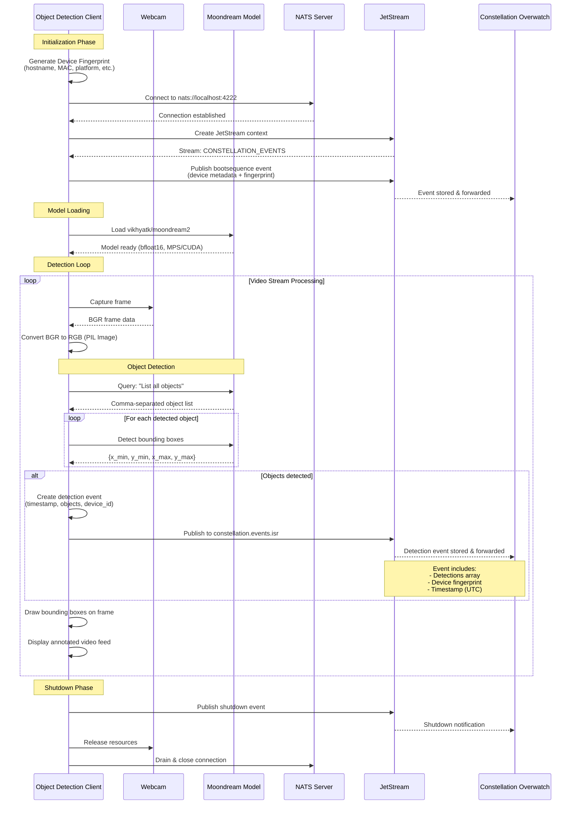

# Constellation Overwatch Object Detection Client

Run video edge inference with [Moondream](https://moondream.ai) and transmit detected objects as events to [Constellation Overwatch](https://github.com/Constellation-Overwatch/constellation-overwatch).

### EXPERIMENTAL
Only tested on macOS. Needs to be integrated with ffmpeg streams from ROS and aviation feeds.

## Requirements

- [Constellation Overwatch](https://github.com/Constellation-Overwatch/constellation-overwatch)
- [uv](https://astral.sh) - A fast Python package installer and resolver

## Data Flow Diagram



## Installation & Setup

```sh
git clone https://github.com/Constellation-Overwatch/overwatch-obj-detection.git
cd overwatch-obj-detection
uv sync
```

### Environment Configuration

The client requires Constellation identifiers to connect to Overwatch. These can be provided via environment variables using a `.env` file:

1. Copy the example environment file:

```sh
cp .env.example .env
```

2. Edit `.env` and add your Constellation credentials:

```env
CONSTELLATION_ORG_ID=your-organization-id-here
CONSTELLATION_ENTITY_ID=your-entity-id-here

# Disable HuggingFace Hub connectivity checks (use cached models only)
HF_HUB_OFFLINE=1
TRANSFORMERS_OFFLINE=1
```

You can obtain the Constellation IDs from:

- Constellation Overwatch Edge Awareness Kit UI
- Your Database Administrator

If these environment variables are not set, the client will prompt you to enter them interactively at runtime.

**Note:** The `HF_HUB_OFFLINE` and `TRANSFORMERS_OFFLINE` settings prevent model loading delays by skipping online checks.

## Usage

### Quick Start

#### Auto-detect and use first available camera

```sh
uv run -m detect
```

The client will automatically detect and use the first available camera.

#### Use external camera (skip built-in)

```sh
uv run -m detect --skip-native
```

Automatically selects the first external camera/capture device, ignoring built-in cameras.

### List Available Video Devices

```sh
uv run -m detect --list-devices
```

Shows all available video capture devices with details (resolution, FPS, backend).

### Camera Diagnostics (Recommended for macOS)

On macOS, camera indices detected by system tools may not match OpenCV's actual indexing. Use the diagnostics tool to verify which camera is at which index:

```sh
uv run camera_diagnostics.py
```

This will:

- List all detected cameras from both system_profiler and OpenCV
- Show resolution, FPS, and backend for each camera
- Offer to preview each camera so you can verify which is which
- Help you determine the correct index to use with `--camera`

**Important:** The preview test is the most reliable way to confirm which camera index corresponds to your desired video source.

### Video Source Options

#### Camera by Index

```sh
# Use specific camera index (0, 1, 2, etc.)
uv run -m detect --camera 1
```

#### Camera by Device Path (Linux)

```sh
# Use specific /dev/video device
uv run -m detect --device /dev/video4
```

#### RTSP Stream

```sh
# Direct RTSP URL
uv run -m detect --rtsp rtsp://192.168.50.2:8554/live/stream

# Or using localhost
uv run -m detect --rtsp rtsp://localhost:8554/live/stream

# Legacy format (still supported)
uv run -m detect --rtsp-ip 192.168.50.2 --rtsp-port 8554 --rtsp-path /live/stream
```

#### HTTP Stream

```sh
# HTTP MJPEG stream
uv run -m detect --http http://192.168.1.100:8080/stream.mjpg
```

### Command Line Options

| Option | Description |
|--------|-------------|
| `--list-devices` | List all available video devices and exit |
| `--camera <index>` | Use camera at specified index (e.g., 0, 1, 2) |
| `--device <path>` | Use device at specified path (e.g., /dev/video4) |
| `--rtsp <url>` | Connect to RTSP stream at URL |
| `--http <url>` | Connect to HTTP stream at URL |
| `--skip-native` | Skip built-in/native cameras during auto-detection |
| `--rtsp-ip <ip>` | RTSP server IP (legacy) |
| `--rtsp-port <port>` | RTSP server port (legacy, default: 8554) |
| `--rtsp-path <path>` | RTSP stream path (legacy, default: /live/stream) |

### Advanced Usage

#### External Capture Devices

For high-quality capture devices like Elgato Cam Link 4K:

```sh
uv run -m detect --skip-native
```

The client automatically applies optimizations:

- Minimal buffering for low latency
- 60 FPS target (if device supports)
- MJPEG codec for hardware acceleration

#### Window Positioning

The OpenCV display window is automatically positioned at (100, 100) with a size of 1280x720 pixels. The window is resizable and can be moved as needed.

To exit the stream, press `q` in the video window.
